# Dream Design for Bambinaia UX

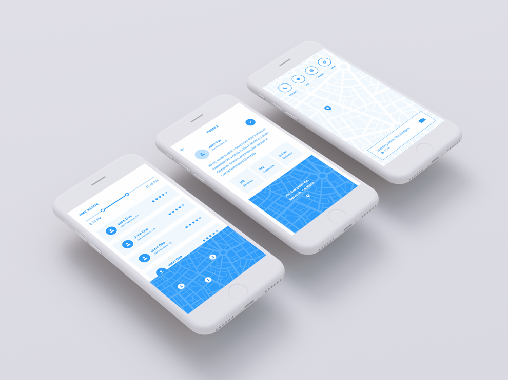

## Application Description
**Bambinaia** is an app for matching parents with nannies on demand. Just like Uber, Airbnb or Instacart, parents should be able to request a high quality nanny for their children on a short notice. More on the vision for the **utility** of this app can be found in the github repo [juanjoneri/bambinaia](https://github.com/juanjoneri/Bambinaia).

The front end and **usability** of this app has not yet been a priority, however in this *Dream Design* document, the vision for the user experience of the service will be showcased in detail, with examples and wireframes. Since it is the case that the UI has not yet been implemented, this project will propose a design rather than a redesign, of what it should look like in the light of the interaction design principles discussed thorough the semester.

This project will focus on mobile interaction, and the wireframes will be showcased in an iPhone device. However the ideas are platform independent, and are only restricted to hand-held, touch-enabled devices such as small Android Tablets, windows Phones, and iPhones among others.


### Web Services Used
The use cases presented in this project rely primarily on calls to the database. The database is composed of two tables, that hold information for Nannies and Parents. The information retrieved, in the form of a JSON object from the database will be used to populate the interface presented to the users. Since the database for Bambinaia is stored and maintained using Googles firebase, the front end will rely on queries specified in the Doc for web at [firebase.google.com/docs](https://firebase.google.com/docs/reference/js/firebase.database.Query) in the server side. The client side will interact with this database using API calls that depend on location and time. Following is an example of a query run using python for searching all nannies in a radius from coordinates, that are available to work at a specific time:

#### Retrieving Nannies

```python
session = Session(server_token=<TOKEN>)
client = BambinaiaNanniesClient(session)

response = client.get_nannies(time=('20:30','22:45'), coords=(37.77, -122.41))
nannies = response.json.get('nannies')
```

In addition, this proposal also accounts for users setting up an appointment (i.e. a parent requesting a nanny and the nanny accepting the offer), and thus API calls for these tasks will be required. Because this API do not currently exist for Bambinaia, the use will be modeled after Uber's API for requesting rides. The detailed documentation is available at [ubber.com/docs](https://developer.uber.com/docs/riders/ride-requests/tutorials/api/python#request-a-ride)

Following is a request for a nanny, chosen from the `nannies` json retrieved in the previous query. This parent is requesting nanny at position 0 at $17 hr. to take care of 2 children from 20:30 to 22:45

#### Requesting a Nanny

```python
nanny_id = nannies[0]['id']
response = client.request_nanny(
    nanny_id=nanny_id,
    start_time='20:30',
    end_time='22:45'
    child_count=2,
    rate=17
)
```

## Top-Level Design/Layout
Two use cases will be envisioned and designed from scratch for touch interaction on a generic mobile device:

1. A parent searching for, choosing and requesting a nanny.
2. A nanny receiving the request, looking at the details of the job, and accepting the offer.

Each use case is composed of four views<a href="#note1" id="note1ref"><sup>1</sup></a>, each designed for a specific task. In other words, each view is designed to bring to the user all the information and tools needed for that step of the process, such as *getting directions to the parent's house*, and thus getting them closer to their goal. This design choice if fairly usual in mobile design, and follows the theory presented by Norman in the *Stages-Of-Action* diagram.

The Views in this design proposal rely on three interaction styles, in the following order:

1. Menus
2. Dialogs
3. Direct Manipulation

Having the interface be composed of descriptive menus, and dialogs, as well as intuitive directly manipulable elements, is a decision that will be explained later in the text, but make the interface rely on recognition instead of recall, and are therefore easy for user with little to no training, as we assume is the case for most parents using this app.

Following are two diagrams that describe the interactions designed for in this assignment, as well as a brief description or *story* of an imaginary user interacting with the app to perform the 2 goals.

### 1. Parent Requesting a Nanny

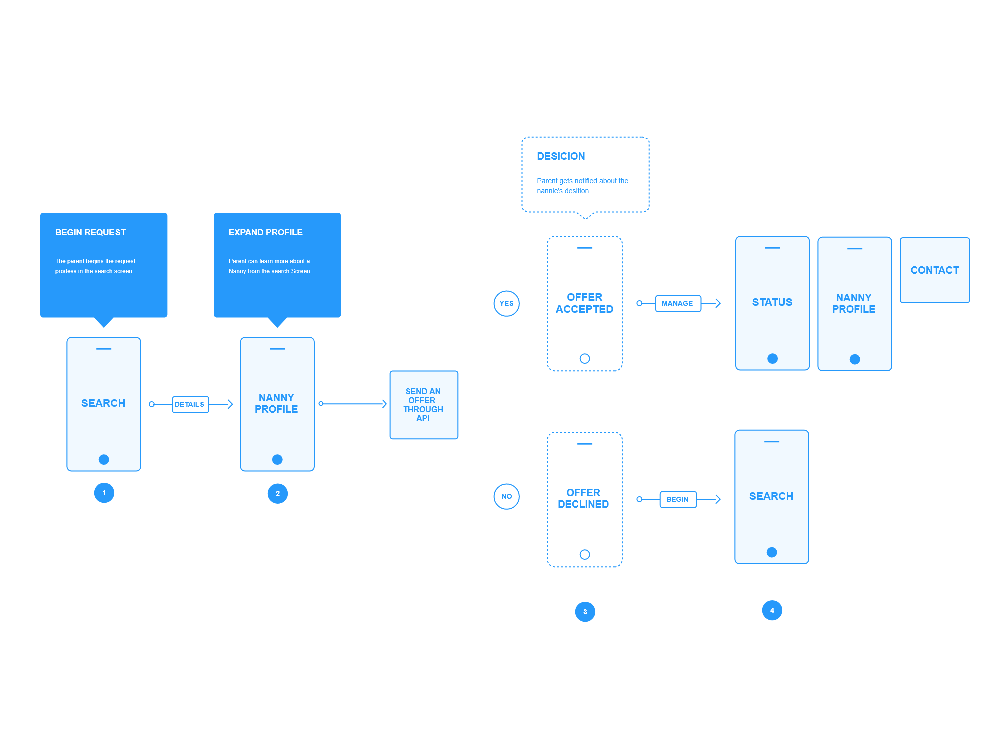

The parent begins the process of requesting a Nanny by searching in the *Search* view. The search view provide **direct manipulation** input widgets for choosing the desired time and location of the request. Once the parent has issued the request, the API will return a subset of the Nannies that match the search criterion, and they will be displayed in a **menu**. This menu will only contain basic, highly relevant information about the Nanny such as rating, name and location.

The parent navigates this menu using touch interaction provided by the OS *(i.e.. scrolling and tapping)* until he/she finds a Nanny of interest. By tapping on the menu option, view number 2 is opened showing the full profile of the Nanny. This view allows the parent to make a request for an appointment. An appointment cannot be requested from the *Begin Request* view to ensure that he or she has reviewed the Nanny in detail before making a decision.

If the nanny declines the job, the parent will be taken to step one again, and shall start the process from the beginning. On the other hand, in the case the nanny accepts the job, the parent will be presented with a dialog with options for contacting the Nanny, reviewing his/her profile, and for reviewing the status of the Nanny. The status view provides the parent with up to date information of what is going on with the Nanny. This view becomes particularly useful during the appointment, for it provides the parent with a way to check what her children are doing, contact them, and locate them.

### 2. Nanny Reviewing Offer

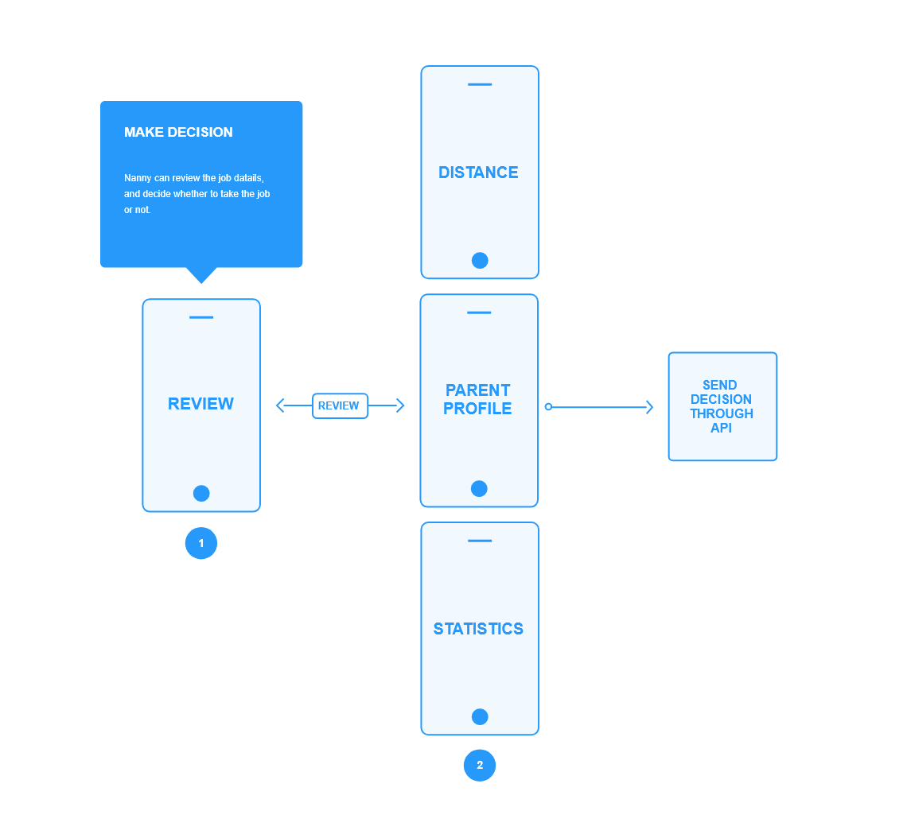

The interaction of the Nanny begins at the **Review** view, once he/she has received a request. This view is a **dialog** that highlights the full amount the nanny will be paid, the distance to the job, and the date and time of the appointment. If the nanny has more than one request at a single time, the request will be stacked side by side and, through **swipes** the nanny can move from one to the other.

The **review** view also provides the Nanny with 3 buttons that take the nanny to view with more information about: how to get to the appointment, the parent user profile *(which includes his/her description, a description of the house and children)*, as well as statistics about the night. The latter serves the purpose of helping the Nanny make a more informed decision about job prospects for the night. For example, the **Analytics** view will show the average rate that parents have been giving for that night so that he/she can compare and see if its fair.

Finally, the nanny can make a decision by pressing one of the two buttons in the bottom of dialog, which will take the parent to step 4 of the process described above.

## Usage Scenarios

### Requesting a Nanny (Parent)

#### Searching for a Nanny

<table style="width:100%;">
	<tr>
		<th>Search</th>
		<th>Nanny Profile</th>
	</tr>
	<tr>
		<td>
			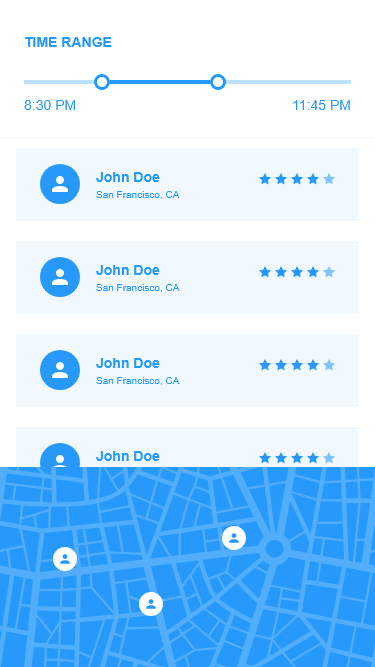
		</td>
		<td>
			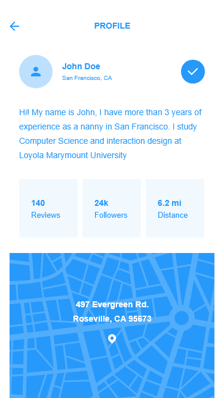
		</td>
	</tr>
</table>

The first step in this interaction consist, as described above, of a parent searching for a desired nanny among the available ones. For this task, the parent makes use of 2 views, which we call "Search" and "Nanny Profile". The views are shown in the table above.

This interface assumes that the parent is familiar with the terminology required for requesting a nanny in general <a href="#note2" id="note2ref"><sup>2</sup></a> . With this in mind, the layout of the search view consists of 3 parts:

1. Time range slider
2. Nannies menu
3. Nannies location Map

The parent uses the time range slider to obtain a rapid-response, and reversible results with all the nannies that can work in that time range. The app makes use of the device's built in GPG to filter that selection further, to only those who are within a specific radius of the parent <a href="#note3" id="note3ref"><sup>3</sup></a>.

The Nannies menu is designed to stablish a direct correspondence with a Nanny. That is, the parent should be able to draw a relation with the **domain object** of a nanny with was he or she sees in the menu item. Each item represents a different nanny, and that is why we provide the name, location, as well as a picture and rating, to show the uniqueness of each object.

Finally, at the bottom of the screen, there is a map where the parent can locate the nannies shown in the nannies menu. The parent can drag and pinch to zoom the map, in order to locate exactly where the nanny is. Each pin in the map has the same picture of the nanny provided in the menu, so that the parent can easily draw a direct correspondence between the two. The main reason for this map is the **enjoyment** in using the interface of the parent. The same information is provided in the menu, however in this way, the information is more **accessible** and natural for the user.

The parent can tap on any of the nannies form the menu to see a detailed user profile of the nanny. This opens a new view, that slides from the right <a href="#note4" id="note4ref"><sup>4</sup></a>, and will have a left pointing arrow at the top of the screen for the parent to be able to **reverse** the action and go back to the Search View. This view is modeled after popular apps such as LinkedIn, Facebook and Google plus, and provides the parent with more detailed in formation about the nanny so that he or she can make a more informed decision about what nanny no hire. This view resembles a card, (i.e.. a business card) of the nanny and aims to make him or her more compelling to the parent. This card also has a map, which, for **consistency**, allows the parent to interact with it through touch, even though it is not very useful at this stage.

#### Notification and Status

<table style="width:100%;">
	<tr>
		<th>Offer Accepted</th>
		<th>Nanny Status</th>
	</tr>
	<tr>
		<td>
			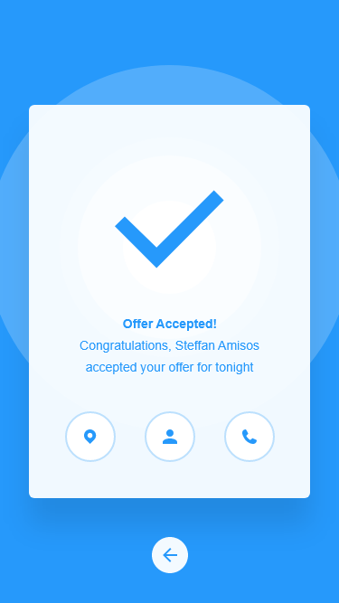
		</td>
		<td>
			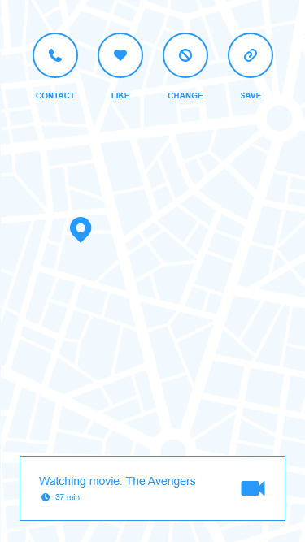
		</td>
	</tr>
</table>

The next stage takes place when the nanny has taken a decision. For the purpose of this proposal we will assume the nanny accepted the job, however the opposite result would have taken the parent to the search view shown above.

The "Offer accepted" is presented to the parent as a **notification**. As proposed by Wickens and Hollands (2000), this notification view follows three main design guidelines: size, sound, and color. This view is presented with a high-contrasts background and a subtle sound, to catch the attention of the parent (since we do not want the nanny to be waiting for too long until the parent takes action). In addition, the view has very few, highly-relevant content, so that there is room for things such as the `tick` icon to be big. Although the parent can exit this view by tapping anywhere in the background, we also provide a left arrow button for **consistency** with other views of the application. The view, however, tries to compel the parent to take action, by prioritizing the action buttons over the exit button.

There are three actions that we want the user to perform at this stage. Those are: calling the nanny, reviewing the nannie's profile and checking the status of the nanny. This actions are suggested to the user via icons, and not text, or this allows the interface to be cleaner.

The right most button will take the parent the pone's default calling application, and populate the phone number field with that of the nanny. The button in the center is takes the parent back to view "Nanny profile", so that he can **remember** what nanny it was the he or she chose.

The left most button takes the parent to the "Nanny Status" view. The parent can access this view any time he or she wants until the appointment is finished, to find relevant information about the status of the nanny. The main component of this view is the map that locates the nanny on real time, so that the parent can make sure that she is safe at home with the kids. There is also a **toolbar** for actions such as calling the nanny, saving the "moment"  <a href="#note5" id="note5ref"><sup>5</sup></a>, requesting the nanny to change what she is currently doing with the kids, or providing positive feedback about the activity. The activity is shown at the bottom of the screen, and highlights the time duration of the activity so far.

#### Final Interaction Sample


### Accepting the Job (Nanny)

#### Notification

<table style="width:100%;">
	<tr>
		<th>Review</th>
	</tr>
	<tr>
		<td>
			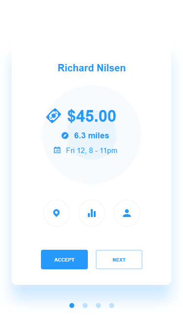
		</td>
	</tr>
</table>

The nanny sample interaction scenario begins with an offer from a parent. At this stage he or she will receive a popup notification with the offer, as well as some of the details for the job. Just like the "Offer Accepted" view for the parent, this view has the form of  a notification that follows Wickens and Hollands (2000) design guidelines, highlighting three things: first and foremost, the amount to be obtained from taking the offer, second, the distance to the house where the job would take place, and finally the date and time of the appointment.

In contrast to the parent's offer accepted view, the nanny can receive many offers at the same time, therefore these are display side by side as cards, and **feedback** is given to the user as to in what card he or she is currently at. This view provides links to three other views that the nanny might find useful before taking the offer <a href="#note6" id="note6ref"><sup>6</sup></a>.

#### Review

<table style="width:100%;">
	<tr>
		<th>Navigation</th>
		<th>Parent Profile</th>
	    <th>Night Analytics</th>
	</tr>
	<tr>
		<td>
			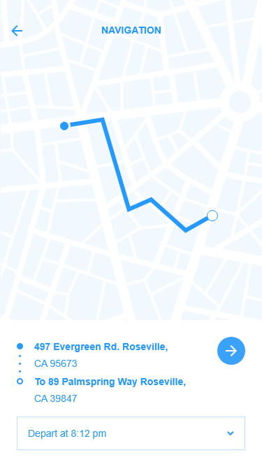
		</td>
		<td>
			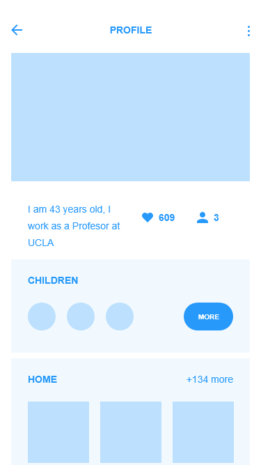
		</td>
	    <td>
			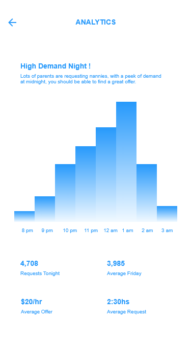
		</td>
	</tr>
</table>

The left most button in the "Review" view takes the nanny to the "Navigation view", where he or she will get an estimate for how far away the house is. The view also provides directions with detailed instructions for how to get there. The nanny can also tap on the right arrow button to be taken to the phone's default navigation if so desired.

The button in the center provides a link to the "Night Analytics view". This view takes highly into consideration the suggestions of Mohageg, Wagner from Bergman (2000), for analytcs can easily scare users and that is the last thing we want. By providing friendly captions such as "you should easily get an offer", and Simplifying the data provided as much as possible, we make the view more approachable to the nannies.

Finally, the right most button takes the nanny to the "Parent Profile" view. Much as the "Nanny Profile" view, this view presents useful information about the requesting parent, such as the number of kids, previous reviews, and pictures of the house. Again we hope to make the parent desirable as an employer by allowing him or her to present himself to the nannies through this view.

#### Final Interaction Sample


## Design Rationale

Since this application essentially "employs" its users *(i.e. the users of Bambinaia act as employers (parents) and employees (nannies) exclusively)*, many of the design decisions have the goal of making the app resemble a professional environment. This is mostly the inspiration for the **mental model** we wish to convey. This is the reason the app uses so many statistics such as distance, rating, time frames, etc.

In addition the app needs to be usable, specially for novice users that are trying the service for the first time, or use the app only sporadically. In other words, we want new users to be able to accomplish the **goal** they set up in their minds as fast as possible, every time, and we want the transactions to be reliable and seamless. With this in mind, many of the design decision are based on the **US Military Standard for Human Engineering Design Criteria**, in particular, the U.I. aims to accomplish the following:

1. Minimize skill and personnel requirements, training time.
2. Achieve required reliability for personnel.
3. Achieve required performance

Design choices for the three objectives specified above include: high use of **icons**, **consistency** within the views of the application as well as other apps the user might use, and stablishing a strong connection  between **interface objects** such as the nannies and **actions** such as calling and the **task objects** and **actions** that our users already know in real life (past experiences doing the same thing, but through another medium). Cards serve this purpose.

Finally, this interface design takes many ideas from **Google's material design** guidelines, such as the circular buttons, and the cards. Although this might conflict with other apps the user might use (since the platform might be iOS, for example), the current state of affairs is that google provides many of the most popular web services for any platform. This means that people are used to interacting with systems that follow this design guidelines.

## Usability Metric Forecast

### Strong metrics

#### Learnability

By design, the system is easy to learn and the user can rapidly start getting some work done with it as explained above. One of the focuses of the design of this interface was the time it takes for a user to accomplish a task in front of a system when the never seen the system before, because we assume most of the users will not have seen anything like Bambinaia before (Since it is so innovative!).

#### Memorability

The system is easy to **remember**, since it was designed so that the casual user is able to return to the system after some period of not having used it, without having to learn everything all over again, by making use of icons and by stablishing a strong connection between the **interface objects and actions**, and the **task objects and actions**.

#### Satisfaction

The system is pleasant to use, making the users **subjectively satisfied** when using it. The interface achieves this by being highly interactive, and making the task of requesting a nanny somewhat a game, by providing things like the "Nanny Status" view, for example.

### Weak metrics

#### Efficiency

A tradeoff had to be made for returning customers. Since we assume this is the rarest subset of our user base, even once the user has learned the system, the level of **productivity** that is possible is not much increased. We do not provide any tools for "power users" such as keyboard shortcuts, so there is no alternative to some of the direct manipulation parts of the interface, like the time range slider. This input methods can be more time consuming, but we are willing to make the tradeoff for the advantage of the process being somewhat slow (we hope) is that the user will be more conscious about his or her actions and thus, make less **errors**.

## References
*Developers | Uber*, www.developer.uber.com/docs/riders/ride-requests/tutorials/api/introduction.

Inc., Apple. *Themes - Overview - IOS Human Interface Guidelines*, www.developer.apple.com/ios/human-interface-guidelines/overview/themes/.

“Introduction - Material Design.” *Google*, Google, www.google.com/design/spec/material-design/introduction.html.

Nielsen, Jakob. *Usability engineering*. Elsevier, 1994.

Norman, Don. *The design of everyday things: Revised and expanded edition*. Basic Books (AZ), 2013.

## Footnotes
<a id="note1" href="#note1ref"><sup>1</sup></a> Google's naming convension for a simple rectangle box which responds to the user's actions in an Android device.

<a id="note2" href="#note2ref"><sup>2</sup></a> Terms a parent would normally use to request a nanny through any medium, not necessarily constrained a mobile application.

<a id="note3" href="#note3ref"><sup>3</sup></a> This value is arbitrary, and could possible be coded as a global static variable. The main point here is that parents will not be shown results of nannies who are in say, another country, for example.

<a id="note4" href="#note4ref"><sup>4</sup></a> This provides consistency with other apps the parent might use on a daily basis. See iOS interface design guidelines.

<a id="note5" href="#note5ref"><sup>5</sup></a> Moments are not discussed in detail in this paper. In summary they are snapshots of activity that the parent can save for future reference. 

<a id="note6" href="#note6ref"><sup>6</sup></a> Note that in this case we do want the nanny to take the offer as soon as possible, for we profit from that, so the main action in this view is the accept button, that is why it is the only colored button.
